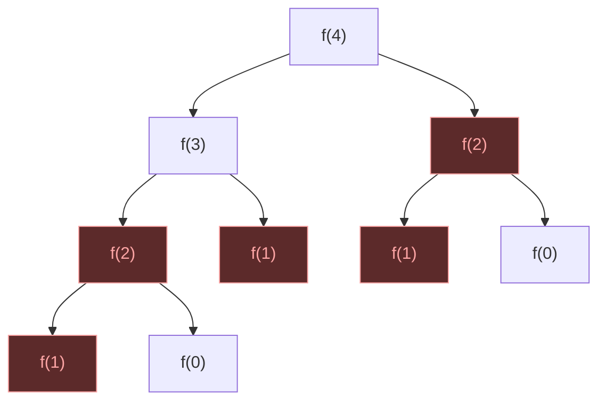
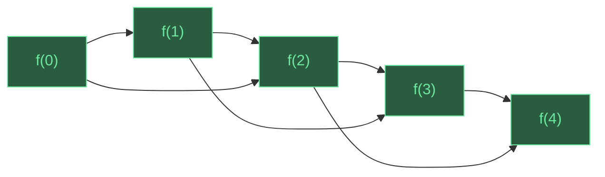

<div class="grid grid-cols-[1fr_1fr] gap-4 items-center w-full">
  <div>
    <div class="uppercase text-base font-bold text-[var(--brand-accent)] text-4xl">LeetCode Problems on Go</div>
    <div class="mt-2 font-bold text-6xl" style="font-family: 'Iowan Old Style', 'Palatino Linotype', Georgia, serif;">Dynamic Programming</div>
    <div class="mt-12 items-center color-[var(--text-secondary)]">Sergei Blinov · AckiNacki</div>
  </div>

  <div class="flex flex-col items-center justify-center">
    <div class="relative w-full overflow-hidden border border-[var(--border-subtle)] rounded-3xl bg-[var(--bg-card)] p-3 shadow-2xl">
      
      <div class="mt-2 rounded-2xl bg-[var(--bg-card)] px-4 py-2 text-lg text-center text-[var(--text-secondary)]">Solving DP problems at a coding interview</div>
    </div>
  </div>
</div>

---
layout: full
---

<div class="w-full h-full relative overflow-hidden">

<!--
  Layout grid (960x540):
  Top row:    [Gopher]  [P≠NP]  [PostgreSQL]  [Euler]  [Ferris]
  Mid row:    [Docker]  [Bayes]            [Basel]  [React]
  Bot row:    [Python]  [Correlation]  [O(n log n)]  [Bun]
-->

<!-- Top row icons -->


<!-- Middle row icons -->


<!-- Bottom row icons -->

<div class="absolute" style="bottom:0px; left:45%; opacity:0.8; transform:translateX(-200px)">
  <div style="font-size:16px; text-align:center; margin-bottom:4px; color:#D97757; font-style:italic; white-space:nowrap; font-weight:bold">You're absolutely right!</div>
  
</div>


<!-- Top row formulas (between icons) -->
<div class="absolute" style="top:50px; left:185px; opacity:0.40; transform: rotate(-9deg)">

$P \neq NP$ ???

</div>
<div class="absolute" style="top:30px; right:200px; opacity:0.50; transform:rotate(11deg)">

$e^{i\pi} + 1 = 0$

</div>

<!-- Middle row formulas (between icons and center) -->
<div class="absolute" style="top:50%; left:170px; opacity:0.3; transform:translateY(45px) translateX(-60px) rotate(-11deg)">

$\sum \frac{1}{n^2} = \frac{\pi^2}{6}$

</div>
<div class="absolute" style="top:50%; right:120px; opacity:0.3; transform:translateY(-50px); font-size:13px">

$P(A|B) = \frac{P(B|A) \cdot P(A)}{P(B)}$

</div>

<!-- Bottom row formulas (between icons) -->
<div class="absolute" style="bottom:40px; right:160px; opacity:0.4; transform: rotate(9deg)">

$O(n \log n)$

</div>

<!-- Main content centered -->
<div class="absolute inset-0 flex flex-col items-center justify-center z-10">
  <div class="font-bold mb-5" style="font-size:4rem; font-family: 'Iowan Old Style', 'Palatino Linotype', Georgia, serif;">Sergei Blinov</div>
  <ul>
    <li><code>Senior Software Engineer @ AckiNacki</code></li>
    <li><code>Math enthusiast</code></li>
    <li><code>Programming language polyglot</code></li>
  </ul>
</div>

</div>

---
layout: two-cols
---

# Why companies still ask LeetCode

<div class="lead">
Because obviously the best way to evaluate engineers is a <span class="accent">timed puzzle contest.</span>
</div>

- 10 years of production experience? — _sorry, you forgot the two-pointer trick_ 😂
- It's not a good test — it's a <em>convenient</em> one
- LLM solves LeetCode Hard from a screenshot faster than you can read it 😅
- 40% of hiring managers don't trust it… but use it anyway 🤷

<p class="text-[var(--text-muted)] mt-2 color-yellow">
And yet… here we all are, grinding LeetCode at midnight 🌙
</p>

::right::

<div class="mt-4 ml-4 rounded-2xl overflow-hidden border border-[var(--border-subtle)] shadow-xl">
  <div style="background:#2a5c3f; padding:12px 16px;">
    <div class="text-xs uppercase tracking-[0.2em] font-bold" style="color:#6ee7a0;">The Interview</div>
    <div class="pt-1 text-sm" style="color:#d1fae5;">
      "Implement a red-black tree with <code>O(1)</code> amortized rotations."
    </div>
    
  </div>
  <div style="background:#5c2a2a; padding:12px 16px;">
    <div class="text-xs uppercase tracking-[0.2em] font-bold" style="color:#fca5a5;">The Job</div>
    <div class="pt-1 text-sm" style="color:#fde8e8;">
      "Move this button 2px to the left."
    </div>
    
  </div>
</div>

---

# Common interview topics

<div class="mt-2">

<div class="text-xs uppercase tracking-[0.2em] font-bold text-[var(--text-muted)] mb-2">Data Structures</div>
<div class="chip-row">
  <div class="chip border-green-400 text-green-400">Arrays & Hashing</div>
  <div class="chip border-green-400 text-green-400">Linked Lists</div>
  <div class="chip border-green-400 text-green-400">Stacks & Queues</div>
  <div class="chip border-amber-400 text-amber-400">Trees & Tries</div>
  <div class="chip border-amber-400 text-amber-400">Heap / Priority Queue</div>
  <div class="chip border-amber-400 text-amber-400">Monotonic Stack</div>
  <div class="chip border-red-400 text-red-400">Segment Tree</div>
  <div class="chip border-red-400 text-red-400">Fenwick Tree</div>
</div>

<div class="text-xs uppercase tracking-[0.2em] font-bold text-[var(--text-muted)] mt-4 mb-2">Techniques & Patterns</div>
<div class="chip-row">
  <div class="chip border-green-400 text-green-400">Two Pointers</div>
  <div class="chip border-green-400 text-green-400">Prefix Sum</div>
  <div class="chip border-green-400 text-green-400">Binary Search</div>
  <div class="chip border-amber-400 text-amber-400">Sliding Window</div>
  <div class="chip border-amber-400 text-amber-400">Bit Manipulation</div>
  <div class="chip border-amber-400 text-amber-400">Union-Find</div>
  <div class="chip border-amber-400 text-amber-400">String Matching (KMP)</div>
  <div class="chip border-red-400 text-red-400">Coordinate Compression</div>
</div>

<div class="text-xs uppercase tracking-[0.2em] font-bold text-[var(--text-muted)] mt-4 mb-2">Algorithms</div>
<div class="chip-row">
  <div class="chip border-green-400 text-green-400">Sorting</div>
  <div class="chip border-amber-400 text-amber-400">BFS / DFS</div>
  <div class="chip border-amber-400 text-amber-400">Backtracking</div>
  <div class="chip border-amber-400 text-amber-400">Greedy</div>
  <div class="chip border-amber-400 text-amber-400">Topological Sort</div>
  <div class="chip border-amber-400 text-amber-400">Shortest Path</div>
  <div class="chip border-red-400 text-red-400">Divide & Conquer</div>
  <div class="chip border-red-400 text-red-400">Game Theory</div>
  <div class="chip font-bold border-[var(--go-blue)] text-[var(--brand-accent)]">Dynamic Programming</div>
</div>

</div>

<div class="mt-4 flex gap-6 text-xs text-[var(--text-muted)]">
  <span class="text-green-400">●</span> <span>Easy</span>
  <span class="text-amber-400">●</span> <span>Medium</span>
  <span class="text-red-400">●</span> <span>Hard</span>
</div>

---

# Why is it called dynamic programming?

<div class="flex flex-col float-right items-center mt-4 ml-8">
  
  <div class="mt-3 text-[var(--text-muted)] font-serif">Richard Bellman (1920–1984)</div>
</div>

- The name is historical, not descriptive
- It does <span class="accent">not</span> mean "programming" as in writing code
- It does <span class="accent">not</span> mean "dynamic" as in changing over time.

<span class="accent">Richard Bellman</span> coined the term in the 1950s while working at RAND Corporation

- "Programming" here means <span class="accent">planning</span> (as in "linear programming")
- He deliberately chose a vague, impressive name to shield his research from politicians who were hostile to mathematics 🤷

---
layout: two-cols
---

<div class="mt-2">

<div class="text-xs uppercase tracking-[0.2em] font-bold text-red-400 mb-4">Pure recursion — recomputes everything</div>



<div class="text-xs uppercase tracking-[0.2em] font-bold text-green-400 mb-4 mt-8">DP — each subproblem solved once</div>



</div>

::right::

# DP ≠ Recursion

<div class="lead">
Recursion is a <span class="accent">form</span>, DP is an <span class="accent">idea</span>.
</div>

- Recursion — just a function calling itself
- It does not imply reusing results
- DP can be top-down (recursive) or bottom-up (iterative)
- Not all recursive solutions are DP, and not all DP needs recursion

---
layout: two-cols
---

<div class="rounded-2xl overflow-hidden border border-[var(--border-subtle)] shadow-xl mr-4">
  <div style="background:#2a5c3f; padding:14px 18px;">
    <div class="text-xs uppercase tracking-[0.2em] font-bold" style="color:#6ee7a0;">Memoization</div>
    <div class="pt-2" style="color:#d1fae5;">

```go
var memo = map[int]int{}
func fib(n int) int {
    if v, ok := memo[n]; ok {
        return v
    }
    memo[n] = fib(n-1) + fib(n-2)
    return memo[n]
}
```

  </div>
    <div class="text-xs mt-1" style="color:#6ee7a0;">✓ Also DP — optimal substructure + overlapping subproblems</div>
  </div>
  <div style="background:#5c4a2a; padding:14px 18px;">
    <div class="text-xs uppercase tracking-[0.2em] font-bold" style="color:#fbbf24;">Also "memoization"</div>
    <div class="pt-2" style="color:#fef3c7;">

```go
var cache = map[int]*User{}
func getUser(id int) *User {
    if u, ok := cache[id]; ok {
        return u
    }
    cache[id] = db.Query(id)
    return cache[id]
}
```

  </div>
    <div class="text-xs mt-1" style="color:#fbbf24;">✗ Not DP — just caching, no subproblem structure</div>
  </div>
</div>

::right::

# DP ≠ Memoization

<div class="lead">
Memoization is a <span class="accent">technique</span> that often implements DP, but not every cache is DP.
</div>

- Memoization = caching results of pure functions
- It is the standard way to implement top-down DP
- But caching an HTTP response is memoization too — not DP
- DP requires two properties:
    - <span class="accent">Optimal substructure</span>
    - <span class="accent">Overlapping subproblems</span>

---
layout: two-cols
---

<div class="mr-4">
  <div class="problem-card">
    <div class="text-sm uppercase tracking-[0.2em] text-red-400 font-semibold">When Greedy Breaks</div>

Coins = `{1, 3, 4}`, target = `6`

🟥 Greedy is not optimal: `4 + 1 + 1` = 3 coins

🟩 DP: `3 + 3` = 2 coins

  </div>
  <div class="mt-3 w-4/5 mx-auto h-88 rounded shadow">
    
  </div>
</div>

::right::

# DP ≠ Greedy

- Greedy makes the <span class="accent">locally best</span> and never looks back
- Greedy works when local optimum guarantees global optimum
- Classic example: **Coin Change**
    - <span class="text-green-400">Greedy works</span> for `{1, 5, 10, 25}` — always pick the biggest coin
    - <span class="text-red-400">Greedy fails</span> for `{1, 3, 4}`, target `6`: greedy gives `4+1+1`, DP gives `3+3`

---

# DP ≠ Backtracking

<div class="grid grid-cols-3 gap-6 mt-12 text-center">
  <div>
    <div class="text-5xl mb-4 opacity-40">🌳</div>
    <pre class="text-xs leading-tight inline-block text-left opacity-50">
    *
   / \
  *   *
 /\   /\
*  * *  *
    </pre>
    <div class="mt-4 text-lg font-bold text-gray-400">Brute Force</div>
    <div class="text-sm text-gray-500 mt-1">visit every node</div>
    <div class="mt-2 font-mono text-red-400">O(2ⁿ)</div>

  </div>
  <div>
    <div class="text-5xl mb-4">🌳</div>
    <pre class="text-xs leading-tight inline-block text-left">
    *
   / \
  *   <span class="text-gray-600">✗</span>
 /\
<span class="text-gray-600">✗</span>  *
    </pre>
    <div class="mt-4 text-lg font-bold text-yellow-400">Backtracking</div>
    <div class="text-sm text-gray-500 mt-1">prune bad branches</div>
    <div class="mt-2 font-mono text-red-400">O(2ⁿ)</div>
  </div>
  <div>
    <div class="text-5xl mb-4">🧠</div>
    <pre class="text-xs leading-tight inline-block text-left">
    *
   / \
  *   * ✓ reuse
 /\
*  * ✓ cache
    </pre>
    <div class="mt-4 text-lg font-bold text-[var(--brand-accent)]">DP</div>
    <div class="text-sm text-gray-500 mt-1">cache &amp; reuse subproblems</div>
    <div class="mt-2 font-mono text-green-400">polynomial</div>
  </div>
</div>

---
layout: two-cols
---

# DP ≠ Combinatorix

<div class=" text-2xl">

$$
C_n = \frac{1}{n+1}\binom{2n}{n}
$$

$$
\begin{array}{lcl}
C_0 = \frac{1}{1}\binom{0}{0} &=& \color{#2dd4bf}\boxed{1} \\[6pt]
C_1 = \frac{1}{2}\binom{2}{1} &=& \color{#2dd4bf}\boxed{1} \\[6pt]
C_2 = \frac{1}{3}\binom{4}{2} &=& \color{#2dd4bf}\boxed{2} \\[6pt]
C_3 = \frac{1}{4}\binom{6}{3} &=& \color{#2dd4bf}\boxed{5} \\[6pt]
C_4 = \frac{1}{5}\binom{8}{4} &=& \color{#2dd4bf}\boxed{14} \\[6pt]
C_5 = \frac{1}{6}\binom{10}{5} &=& \color{#2dd4bf}\boxed{42}
\end{array}
$$

</div>

::right::

<svg viewBox="0 0 310 310" class="mt-13 w-full mx-auto" xmlns="http://www.w3.org/2000/svg">
  <style>
    .cell { fill: #1e293b; stroke: #334155; stroke-width: 1; }
    .cell-diag { fill: #0d9488; fill-opacity: 0.25; stroke: #2dd4bf; stroke-width: 1.5; }
    .num { fill: #e2e8f0; font-family: monospace; font-size: 14px; text-anchor: middle; dominant-baseline: central; }
    .num-diag { fill: #2dd4bf; font-family: monospace; font-size: 14px; font-weight: bold; text-anchor: middle; dominant-baseline: central; }
    .cell-hl { fill: #f59e0b; fill-opacity: 0.2; stroke: #fbbf24; stroke-width: 1.5; }
    .num-hl { fill: #fbbf24; font-family: monospace; font-size: 14px; font-weight: bold; text-anchor: middle; dominant-baseline: central; }
    .arrow { stroke: #fbbf24; stroke-width: 1.5; fill: none; marker-end: url(#arr); }
  </style>
  <defs>
    <marker id="arr" markerWidth="6" markerHeight="4" refX="5" refY="2" orient="auto">
      <path d="M0,0 L6,2 L0,4" fill="#fbbf24"/>
    </marker>
  </defs>
  <!-- row 0 -->
  <rect x="10" y="10" width="38" height="38" rx="4" class="cell"/>
  <text x="29" y="29" class="num">1</text>
  <!-- row 1 -->
  <rect x="10" y="62" width="38" height="38" rx="4" class="cell"/>
  <text x="29" y="81" class="num">1</text>
  <rect x="62" y="62" width="38" height="38" rx="4" class="cell-diag"/>
  <text x="81" y="81" class="num-diag">1</text>
  <!-- row 2 -->
  <rect x="10" y="114" width="38" height="38" rx="4" class="cell"/>
  <text x="29" y="133" class="num">1</text>
  <rect x="62" y="114" width="38" height="38" rx="4" class="cell"/>
  <text x="81" y="133" class="num">2</text>
  <rect x="114" y="114" width="38" height="38" rx="4" class="cell-diag"/>
  <text x="133" y="133" class="num-diag">2</text>
  <!-- row 3 -->
  <rect x="10" y="166" width="38" height="38" rx="4" class="cell"/>
  <text x="29" y="185" class="num">1</text>
  <rect x="62" y="166" width="38" height="38" rx="4" class="cell"/>
  <text x="81" y="185" class="num">3</text>
  <rect x="114" y="166" width="38" height="38" rx="4" class="cell"/>
  <text x="133" y="185" class="num">5</text>
  <rect x="166" y="166" width="38" height="38" rx="4" class="cell-diag"/>
  <text x="185" y="185" class="num-diag">5</text>
  <!-- row 4 -->
  <rect x="10" y="218" width="38" height="38" rx="4" class="cell"/>
  <text x="29" y="237" class="num">1</text>
  <rect x="62" y="218" width="38" height="38" rx="4" class="cell"/>
  <text x="81" y="237" class="num">4</text>
  <rect x="114" y="218" width="38" height="38" rx="4" class="cell-hl"/>
  <text x="133" y="237" class="num-hl">9</text>
  <!-- arrows: 4 (left) + 5 (above) = 9 -->
  <path d="M101,237 L112,237" class="arrow"/>
  <path d="M133,205 L133,216" class="arrow"/>
  <rect x="166" y="218" width="38" height="38" rx="4" class="cell"/>
  <text x="185" y="237" class="num">14</text>
  <rect x="218" y="218" width="38" height="38" rx="4" class="cell-diag"/>
  <text x="237" y="237" class="num-diag">14</text>
  <!-- row 5 -->
  <rect x="10" y="270" width="38" height="38" rx="4" class="cell"/>
  <text x="29" y="289" class="num">1</text>
  <rect x="62" y="270" width="38" height="38" rx="4" class="cell"/>
  <text x="81" y="289" class="num">5</text>
  <rect x="114" y="270" width="38" height="38" rx="4" class="cell"/>
  <text x="133" y="289" class="num">14</text>
  <rect x="166" y="270" width="38" height="38" rx="4" class="cell"/>
  <text x="185" y="289" class="num">28</text>
  <rect x="218" y="270" width="38" height="38" rx="4" class="cell"/>
  <text x="237" y="289" class="num">42</text>
  <rect x="270" y="270" width="38" height="38" rx="4" class="cell-diag"/>
  <text x="289" y="289" class="num-diag">42</text>
</svg>

---
layout: center
---

<div class="text-center">
  <div class="text-6xl mb-8">🐧</div>
  <div class="text-4xl font-bold italic">"Talk is cheap.</div>
  <div class="text-4xl font-bold italic mb-6">Show me the <span class="text-[var(--brand-accent)]">code</span>."</div>
  <div class="text-lg text-gray-500">— Linus Torvalds</div>
</div>

---

# Problem 1: House Robber

<div class="problem-card">

- 🏘️ A house robber has a list of houses with amount of gold in them
- ⚠️ **He can't rob two neighbors** (it will be too suspicious)
- 🎯 Maximize the total loot

</div>

<svg viewBox="0 0 680 230" class="mt-2 w-full" xmlns="http://www.w3.org/2000/svg">
  <style>
    .h { width: 52px; height: 52px; rx: 4; }
    .rob { fill: #0d9488; fill-opacity: 0.3; stroke: #2dd4bf; stroke-width: 1.5; }
    .skip { fill: #1e293b; stroke: #334155; stroke-width: 1; }
    .hnum { font-family: monospace; font-size: 16px; text-anchor: middle; dominant-baseline: central; }
    .hnum-rob { fill: #2dd4bf; font-weight: bold; }
    .hnum-skip { fill: #64748b; }
    .dp { font-family: monospace; font-size: 13px; text-anchor: middle; dominant-baseline: central; fill: #94a3b8; }
    .lbl { font-family: sans-serif; font-size: 11px; fill: #64748b; text-anchor: end; dominant-baseline: central; }
    .idx { font-family: monospace; font-size: 10px; fill: #475569; text-anchor: middle; }
    .roof { stroke-width: 1.5; fill: none; }
    .roof-rob { stroke: #2dd4bf; }
    .roof-skip { stroke: #334155; }
    .ans { font-family: monospace; font-size: 14px; fill: #2dd4bf; font-weight: bold; }
    .ex-lbl { font-family: sans-serif; font-size: 12px; fill: #94a3b8; font-weight: bold; }
  </style>
  <!-- indices -->
  <text x="48" y="12" class="idx">0</text>
  <text x="112" y="12" class="idx">1</text>
  <text x="176" y="12" class="idx">2</text>
  <text x="240" y="12" class="idx">3</text>
  <text x="304" y="12" class="idx">4</text>
  <text x="368" y="12" class="idx">5</text>
  <text x="432" y="12" class="idx">6</text>
  <text x="496" y="12" class="idx">7</text>
  <text x="560" y="12" class="idx">8</text>
  <text x="624" y="12" class="idx">9</text>
  <!-- roofs -->
  <path d="M28,22 L48,14 L68,22" class="roof roof-rob"/>
  <path d="M92,22 L112,14 L132,22" class="roof roof-skip"/>
  <path d="M156,22 L176,14 L196,22" class="roof roof-rob"/>
  <path d="M220,22 L240,14 L260,22" class="roof roof-skip"/>
  <path d="M284,22 L304,14 L324,22" class="roof roof-rob"/>
  <path d="M348,22 L368,14 L388,22" class="roof roof-skip"/>
  <path d="M412,22 L432,14 L452,22" class="roof roof-rob"/>
  <path d="M476,22 L496,14 L516,22" class="roof roof-skip"/>
  <path d="M540,22 L560,14 L580,22" class="roof roof-skip"/>
  <path d="M604,22 L624,14 L644,22" class="roof roof-rob"/>
  <!-- houses: nums = [2, 7, 9, 3, 1, 5, 8, 2, 4, 6] -->
  <!-- robbed: 0,2,4,6,9 = 2+9+1+8+6 = 26 -->
  <rect x="22" y="22" class="h rob"/>
  <text x="48" y="48" class="hnum hnum-rob">2</text>
  <rect x="86" y="22" class="h skip"/>
  <text x="112" y="48" class="hnum hnum-skip">7</text>
  <rect x="150" y="22" class="h rob"/>
  <text x="176" y="48" class="hnum hnum-rob">9</text>
  <rect x="214" y="22" class="h skip"/>
  <text x="240" y="48" class="hnum hnum-skip">3</text>
  <rect x="278" y="22" class="h rob"/>
  <text x="304" y="48" class="hnum hnum-rob">1</text>
  <rect x="342" y="22" class="h skip"/>
  <text x="368" y="48" class="hnum hnum-skip">5</text>
  <rect x="406" y="22" class="h rob"/>
  <text x="432" y="48" class="hnum hnum-rob">8</text>
  <rect x="470" y="22" class="h skip"/>
  <text x="496" y="48" class="hnum hnum-skip">2</text>
  <rect x="534" y="22" class="h skip"/>
  <text x="560" y="48" class="hnum hnum-skip">4</text>
  <rect x="598" y="22" class="h rob"/>
  <text x="624" y="48" class="hnum hnum-rob">6</text>
  <!-- answer -->
  <text x="48" y="95" class="ans"><tspan class="ex-lbl">Example 1: </tspan>2 + 9 + 1 + 8 + 6 = 26</text>
  <!-- example 2: nums = [10,1,1,10,1,1,10,1,1,10], rob 0,3,6,9 = 40 -->
  <!-- roofs -->
  <path d="M28,147 L48,139 L68,147" class="roof roof-rob"/>
  <path d="M92,147 L112,139 L132,147" class="roof roof-skip"/>
  <path d="M156,147 L176,139 L196,147" class="roof roof-skip"/>
  <path d="M220,147 L240,139 L260,147" class="roof roof-rob"/>
  <path d="M284,147 L304,139 L324,147" class="roof roof-skip"/>
  <path d="M348,147 L368,139 L388,147" class="roof roof-skip"/>
  <path d="M412,147 L432,139 L452,147" class="roof roof-rob"/>
  <path d="M476,147 L496,139 L516,147" class="roof roof-skip"/>
  <path d="M540,147 L560,139 L580,147" class="roof roof-skip"/>
  <path d="M604,147 L624,139 L644,147" class="roof roof-rob"/>
  <!-- houses -->
  <rect x="22" y="147" class="h rob"/>
  <text x="48" y="173" class="hnum hnum-rob">10</text>
  <rect x="86" y="147" class="h skip"/>
  <text x="112" y="173" class="hnum hnum-skip">1</text>
  <rect x="150" y="147" class="h skip"/>
  <text x="176" y="173" class="hnum hnum-skip">1</text>
  <rect x="214" y="147" class="h rob"/>
  <text x="240" y="173" class="hnum hnum-rob">10</text>
  <rect x="278" y="147" class="h skip"/>
  <text x="304" y="173" class="hnum hnum-skip">1</text>
  <rect x="342" y="147" class="h skip"/>
  <text x="368" y="173" class="hnum hnum-skip">1</text>
  <rect x="406" y="147" class="h rob"/>
  <text x="432" y="173" class="hnum hnum-rob">10</text>
  <rect x="470" y="147" class="h skip"/>
  <text x="496" y="173" class="hnum hnum-skip">1</text>
  <rect x="534" y="147" class="h skip"/>
  <text x="560" y="173" class="hnum hnum-skip">1</text>
  <rect x="598" y="147" class="h rob"/>
  <text x="624" y="173" class="hnum hnum-rob">10</text>
  <!-- answer 2 -->
  <text x="48" y="220" class="ans"><tspan class="ex-lbl">Example 2: </tspan>10 + 10 + 10 + 10 = 40</text>
</svg>

---

# Problem 1: House Robber: State And Transition

`dp[i]` = best answer considering houses `0..i`

Recurrence:

```go
dp[i] = max(
  dp[i - 1],           // skip house i
  dp[i - 2] + nums[i]  // rob house i
)
```

Base cases:

- `dp[0] = nums[0]`
- `dp[1] = max(nums[0], nums[1])`

<style>
.slidev-code {
  font-size: 1.2em !important;
  line-height: 1.5 !important;
}
</style>

---

# Problem 1: House Robber: Solution

```go
func rob(nums []int) int {
	if len(nums) == 1 {
		return nums[0]
	}

	prev, cur := nums[0], max(nums[0], nums[1])

	for i := 2; i < len(nums); i++ {
		prev, cur = cur, max(cur, prev+nums[i])
	}

	return cur
}
```

<style>
.slidev-code {
  font-size: 1em !important;
}
</style>

---

# Problem 2: Longest Increasing Subsequence

<div class="problem-card mt-6">

- 🔢 An array of random numbers
- 📈 Pick elements in strictly increasing order
- 🔀 Elements don't have to be adjacent
- 🎯 Find <span class="color-yellow">the longest</span> such subsequence

</div>

<svg viewBox="0 0 680 145" class="mt-4 w-full" xmlns="http://www.w3.org/2000/svg">
  <style>
    .lis-box { width: 52px; height: 52px; rx: 4; }
    .lis-pick { fill: #0d9488; fill-opacity: 0.15; stroke: #2dd4bf; stroke-width: 1; stroke-dasharray: 4 2; }
    .lis-skip { fill: #1e293b; stroke: #334155; stroke-width: 1; }
    .lis-out { fill: #0d9488; fill-opacity: 0.3; stroke: #2dd4bf; stroke-width: 1.5; }
    .lis-num { font-family: monospace; font-size: 16px; text-anchor: middle; dominant-baseline: central; }
    .lis-num-pick { fill: #2dd4bf; fill-opacity: 0.4; }
    .lis-num-skip { fill: #64748b; }
    .lis-num-out { fill: #2dd4bf; font-weight: bold; }
    .lis-idx { font-family: monospace; font-size: 10px; fill: #475569; text-anchor: middle; }
    .lis-ans { font-family: monospace; font-size: 14px; fill: #2dd4bf; font-weight: bold; }
    .lis-line { stroke: #2dd4bf; stroke-width: 1; stroke-dasharray: 3 3; opacity: 0.4; }
    .lis-lbl { font-family: sans-serif; font-size: 11px; fill: #64748b; }
  </style>
  <!-- nums = [10, 9, 2, 5, 3, 7, 101, 18, 2] → LIS = [2, 3, 7, 18] = length 4 -->
  <!-- indices -->
  <text x="48" y="10" class="lis-idx">0</text>
  <text x="112" y="10" class="lis-idx">1</text>
  <text x="176" y="10" class="lis-idx">2</text>
  <text x="240" y="10" class="lis-idx">3</text>
  <text x="304" y="10" class="lis-idx">4</text>
  <text x="368" y="10" class="lis-idx">5</text>
  <text x="432" y="10" class="lis-idx">6</text>
  <text x="496" y="10" class="lis-idx">7</text>
  <text x="560" y="10" class="lis-idx">8</text>
  <!-- top row: original array, picked slots shown as ghost -->
  <rect x="22" y="16" class="lis-box lis-skip"/>
  <text x="48" y="42" class="lis-num lis-num-skip">10</text>
  <rect x="86" y="16" class="lis-box lis-skip"/>
  <text x="112" y="42" class="lis-num lis-num-skip">9</text>
  <rect x="150" y="16" class="lis-box lis-pick"/>
  <text x="176" y="42" class="lis-num lis-num-pick">2</text>
  <rect x="214" y="16" class="lis-box lis-skip"/>
  <text x="240" y="42" class="lis-num lis-num-skip">5</text>
  <rect x="278" y="16" class="lis-box lis-pick"/>
  <text x="304" y="42" class="lis-num lis-num-pick">3</text>
  <rect x="342" y="16" class="lis-box lis-pick"/>
  <text x="368" y="42" class="lis-num lis-num-pick">7</text>
  <rect x="406" y="16" class="lis-box lis-skip"/>
  <text x="432" y="42" class="lis-num lis-num-skip">101</text>
  <rect x="470" y="16" class="lis-box lis-pick"/>
  <text x="496" y="42" class="lis-num lis-num-pick">18</text>
  <rect x="534" y="16" class="lis-box lis-skip"/>
  <text x="560" y="42" class="lis-num lis-num-skip">2</text>
  <!-- dashed lines from ghost slots to extracted row -->
  <line x1="176" y1="68" x2="112" y2="86" class="lis-line"/>
  <line x1="304" y1="68" x2="176" y2="86" class="lis-line"/>
  <line x1="368" y1="68" x2="240" y2="86" class="lis-line"/>
  <line x1="496" y1="68" x2="304" y2="86" class="lis-line"/>
  <!-- bottom row: extracted LIS -->
  <text x="48" y="115" class="lis-lbl">LIS →</text>
  <rect x="86" y="86" class="lis-box lis-out"/>
  <text x="112" y="112" class="lis-num lis-num-out">2</text>
  <rect x="150" y="86" class="lis-box lis-out"/>
  <text x="176" y="112" class="lis-num lis-num-out">3</text>
  <rect x="214" y="86" class="lis-box lis-out"/>
  <text x="240" y="112" class="lis-num lis-num-out">7</text>
  <rect x="278" y="86" class="lis-box lis-out"/>
  <text x="304" y="112" class="lis-num lis-num-out">18</text>
  <!-- answer -->
  <text x="348" y="115" class="lis-ans">— length 4</text>
</svg>

---

<svg viewBox="0 0 680 380" class="w-full mx-auto" xmlns="http://www.w3.org/2000/svg">
  <style>
    .lv-box { width: 52px; height: 52px; rx: 4; }
    .lv-default { fill: #1e293b; stroke: #334155; stroke-width: 1; }
    .lv-active { fill: #0d9488; fill-opacity: 0.3; stroke: #2dd4bf; stroke-width: 1.5; }
    .lv-ghost { fill: #1e3a5f; fill-opacity: 0.15; stroke: #38bdf8; stroke-width: 1; stroke-dasharray: 4 2; }
    .lv-pulled { fill: #1e3a5f; fill-opacity: 0.4; stroke: #38bdf8; stroke-width: 1.5; }
    .lv-num { font-family: monospace; font-size: 16px; text-anchor: middle; dominant-baseline: central; }
    .lv-num-def { fill: #94a3b8; }
    .lv-num-act { fill: #2dd4bf; font-weight: bold; }
    .lv-num-ghost { fill: #38bdf8; opacity: 0.4; }
    .lv-num-pulled { fill: #38bdf8; font-weight: bold; }
    .lv-idx { font-family: monospace; font-size: 10px; fill: #475569; text-anchor: middle; }
    .lv-dp { font-family: monospace; font-size: 14px; text-anchor: middle; dominant-baseline: central; }
    .lv-dp-val { fill: #f59e0b; font-weight: bold; }
    .lv-dp-dim { fill: #64748b; }
    .lv-lbl { font-family: sans-serif; font-size: 11px; fill: #64748b; }
    .lv-line { stroke: #38bdf8; stroke-width: 1; stroke-dasharray: 3 3; opacity: 0.3; }
    .lv-note { font-family: sans-serif; font-size: 13px; fill: #94a3b8; }
    .lv-accent { fill: #2dd4bf; font-weight: bold; }
  </style>
  <!-- nums = [10, 9, 2, 5, 3, 7, 101, 18, 2] -->
  <!-- dp   = [ 1, 1, 1, 2, 2, 3,   4,  4, 1] -->
  <!-- Computing dp[5]: sources are j=2(2), j=3(5), j=4(3) — all < 7 -->
  <!-- indices -->
  <text x="48" y="10" class="lv-idx">0</text>
  <text x="112" y="10" class="lv-idx">1</text>
  <text x="176" y="10" class="lv-idx">2</text>
  <text x="240" y="10" class="lv-idx">3</text>
  <text x="304" y="10" class="lv-idx">4</text>
  <text x="368" y="10" class="lv-idx">5</text>
  <text x="432" y="10" class="lv-idx">6</text>
  <text x="496" y="10" class="lv-idx">7</text>
  <text x="560" y="10" class="lv-idx">8</text>
  <!-- top row: array with ghost slots for sources -->
  <rect x="22" y="16" class="lv-box lv-default"/>
  <text x="48" y="42" class="lv-num lv-num-def">10</text>
  <rect x="86" y="16" class="lv-box lv-default"/>
  <text x="112" y="42" class="lv-num lv-num-def">9</text>
  <rect x="150" y="16" class="lv-box lv-ghost"/>
  <text x="176" y="42" class="lv-num lv-num-ghost">2</text>
  <rect x="214" y="16" class="lv-box lv-ghost"/>
  <text x="240" y="42" class="lv-num lv-num-ghost">5</text>
  <rect x="278" y="16" class="lv-box lv-ghost"/>
  <text x="304" y="42" class="lv-num lv-num-ghost">3</text>
  <rect x="342" y="16" class="lv-box lv-active"/>
  <text x="368" y="42" class="lv-num lv-num-act">7</text>
  <rect x="406" y="16" class="lv-box lv-default"/>
  <text x="432" y="42" class="lv-num lv-num-def">101</text>
  <rect x="470" y="16" class="lv-box lv-default"/>
  <text x="496" y="42" class="lv-num lv-num-def">18</text>
  <rect x="534" y="16" class="lv-box lv-default"/>
  <text x="560" y="42" class="lv-num lv-num-def">2</text>
  <!-- dashed lines straight down from ghosts to pulled-out cards -->
  <line x1="176" y1="68" x2="176" y2="86" class="lv-line"/>
  <line x1="240" y1="68" x2="240" y2="86" class="lv-line"/>
  <line x1="304" y1="68" x2="304" y2="86" class="lv-line"/>
  <!-- labels under non-pulled cards: >= 7 -->
  <text x="48" y="82" class="lv-dp lv-dp-dim">≥ 7</text>
  <text x="112" y="82" class="lv-dp lv-dp-dim">≥ 7</text>
  <!-- pulled-out row: candidates < 7, directly below their original positions -->
  <rect x="150" y="86" class="lv-box lv-pulled"/>
  <text x="176" y="112" class="lv-num lv-num-pulled">2</text>
  <text x="176" y="130" class="lv-dp lv-dp-dim">dp=1</text>
  <rect x="214" y="86" class="lv-box lv-pulled"/>
  <text x="240" y="112" class="lv-num lv-num-pulled">5</text>
  <text x="240" y="130" class="lv-dp lv-dp-val">dp=2</text>
  <rect x="278" y="86" class="lv-box lv-pulled"/>
  <text x="304" y="112" class="lv-num lv-num-pulled">3</text>
  <text x="304" y="130" class="lv-dp lv-dp-val">dp=2</text>
  <!-- explanation -->
  <text x="48" y="160" class="lv-note">Best predecessor: <tspan class="lv-dp-val">max(1, 2, 2)</tspan> = 2</text>
  <text x="48" y="180" class="lv-note"><tspan class="lv-accent">dp[5]</tspan> = 2 + 1 = <tspan class="lv-accent">3</tspan></text>

  <!-- ═══ Step 2: Computing dp[6], value 101 ═══ -->
  <!-- All previous elements < 101, so all are sources -->
  <!-- indices -->

<text x="48" y="210" class="lv-idx">0</text>
<text x="112" y="210" class="lv-idx">1</text>
<text x="176" y="210" class="lv-idx">2</text>
<text x="240" y="210" class="lv-idx">3</text>
<text x="304" y="210" class="lv-idx">4</text>
<text x="368" y="210" class="lv-idx">5</text>
<text x="432" y="210" class="lv-idx">6</text>
<text x="496" y="210" class="lv-idx">7</text>
<text x="560" y="210" class="lv-idx">8</text>

  <!-- array with ALL previous as ghosts (all < 101) -->
  <rect x="22" y="216" class="lv-box lv-ghost"/>
  <text x="48" y="242" class="lv-num lv-num-ghost">10</text>
  <rect x="86" y="216" class="lv-box lv-ghost"/>
  <text x="112" y="242" class="lv-num lv-num-ghost">9</text>
  <rect x="150" y="216" class="lv-box lv-ghost"/>
  <text x="176" y="242" class="lv-num lv-num-ghost">2</text>
  <rect x="214" y="216" class="lv-box lv-ghost"/>
  <text x="240" y="242" class="lv-num lv-num-ghost">5</text>
  <rect x="278" y="216" class="lv-box lv-ghost"/>
  <text x="304" y="242" class="lv-num lv-num-ghost">3</text>
  <rect x="342" y="216" class="lv-box lv-ghost"/>
  <text x="368" y="242" class="lv-num lv-num-ghost">7</text>
  <rect x="406" y="216" class="lv-box lv-active"/>
  <text x="432" y="242" class="lv-num lv-num-act">101</text>
  <rect x="470" y="216" class="lv-box lv-default"/>
  <text x="496" y="242" class="lv-num lv-num-def">18</text>
  <rect x="534" y="216" class="lv-box lv-default"/>
  <text x="560" y="242" class="lv-num lv-num-def">2</text>
  <!-- dashed lines from ghosts to pulled-out cards -->
  <line x1="48" y1="268" x2="48" y2="286" class="lv-line"/>
  <line x1="112" y1="268" x2="112" y2="286" class="lv-line"/>
  <line x1="176" y1="268" x2="176" y2="286" class="lv-line"/>
  <line x1="240" y1="268" x2="240" y2="286" class="lv-line"/>
  <line x1="304" y1="268" x2="304" y2="286" class="lv-line"/>
  <line x1="368" y1="268" x2="368" y2="286" class="lv-line"/>
  <!-- pulled-out row: all candidates < 101 -->
  <rect x="22" y="286" class="lv-box lv-pulled"/>
  <text x="48" y="312" class="lv-num lv-num-pulled">10</text>
  <text x="48" y="330" class="lv-dp lv-dp-dim">dp=1</text>
  <rect x="86" y="286" class="lv-box lv-pulled"/>
  <text x="112" y="312" class="lv-num lv-num-pulled">9</text>
  <text x="112" y="330" class="lv-dp lv-dp-dim">dp=1</text>
  <rect x="150" y="286" class="lv-box lv-pulled"/>
  <text x="176" y="312" class="lv-num lv-num-pulled">2</text>
  <text x="176" y="330" class="lv-dp lv-dp-dim">dp=1</text>
  <rect x="214" y="286" class="lv-box lv-pulled"/>
  <text x="240" y="312" class="lv-num lv-num-pulled">5</text>
  <text x="240" y="330" class="lv-dp lv-dp-dim">dp=2</text>
  <rect x="278" y="286" class="lv-box lv-pulled"/>
  <text x="304" y="312" class="lv-num lv-num-pulled">3</text>
  <text x="304" y="330" class="lv-dp lv-dp-dim">dp=2</text>
  <rect x="342" y="286" class="lv-box lv-pulled"/>
  <text x="368" y="312" class="lv-num lv-num-pulled">7</text>
  <text x="368" y="330" class="lv-dp lv-dp-val">dp=3</text>
  <!-- explanation -->
  <text x="48" y="358" class="lv-note">Best predecessor: <tspan class="lv-dp-val">max(1, 1, 1, 2, 2, 3)</tspan> = 3</text>
  <text x="48" y="376" class="lv-note"><tspan class="lv-accent">dp[6]</tspan> = 3 + 1 = <tspan class="lv-accent">4</tspan></text>
</svg>

---

# Problem 2: State And Transition

`dp[i]` = length of the longest increasing subsequence that ends at `i`

## Key idea

- We are asking for the best subsequence that must end at a specific position

```go
dp[i] = 1 + max(dp[j]) for all j < i where nums[j] < nums[i]
```

If there is no such `j`, then:

```go
dp[i] = 1
```

## Final answer

```go
return max(dp[i]) for all i
```

<style>
.slidev-code {
  font-size: 1em !important;
}
</style>

---

# Problem 2: Solution

```go
func longestIncreasingSubsequence(nums []int) int {
	dp := make([]int, len(nums))
	globalMax := 1

	for i := range nums {
		localMax := 1
		for j := range i {
			if nums[j] < nums[i] {
				localMax = max(localMax, dp[j]+1)
			}
		}
		dp[i], globalMax = localMax, max(globalMax, localMax)
	}

	return globalMax
}
```

<style>
.slidev-code {
  font-size: 0.8em !important;
}
</style>

---

# Problem 3: Cherry Pickup II

<div class="lead">
DP gets genuinely hard: the state encodes
<span class="accent">two agents moving simultaneously</span>.
</div>

<div class="flex gap-6 mt-4 items-center">

<svg viewBox="0 0 380 380" class="w-96 shrink-0" xmlns="http://www.w3.org/2000/svg">
  <defs>
    <marker id="ah1" markerWidth="6" markerHeight="4" refX="5" refY="2" orient="auto">
      <polygon points="0 0, 6 4, 0 4" fill="#2dd4bf"/>
    </marker>
    <marker id="ah2" markerWidth="6" markerHeight="4" refX="5" refY="2" orient="auto">
      <polygon points="0 0, 6 4, 0 4" fill="#f472b6"/>
    </marker>
  </defs>
  <!-- grid -->
  <g>
    <rect x="0" y="0" width="380" height="380" rx="8" fill="#0f172a" stroke="#334155" stroke-width="1"/>
    <!-- cells -->
    <g fill="#1e293b" stroke="#334155" stroke-width="0.5">
      <rect x="10" y="10" width="68" height="68" rx="3"/><rect x="84" y="10" width="68" height="68" rx="3"/>
      <rect x="158" y="10" width="68" height="68" rx="3"/><rect x="232" y="10" width="68" height="68" rx="3"/>
      <rect x="306" y="10" width="68" height="68" rx="3"/>
      <rect x="10" y="84" width="68" height="68" rx="3"/><rect x="84" y="84" width="68" height="68" rx="3"/>
      <rect x="158" y="84" width="68" height="68" rx="3"/><rect x="232" y="84" width="68" height="68" rx="3"/>
      <rect x="306" y="84" width="68" height="68" rx="3"/>
      <rect x="10" y="158" width="68" height="68" rx="3"/><rect x="84" y="158" width="68" height="68" rx="3"/>
      <rect x="158" y="158" width="68" height="68" rx="3"/><rect x="232" y="158" width="68" height="68" rx="3"/>
      <rect x="306" y="158" width="68" height="68" rx="3"/>
      <rect x="10" y="232" width="68" height="68" rx="3"/><rect x="84" y="232" width="68" height="68" rx="3"/>
      <rect x="158" y="232" width="68" height="68" rx="3"/><rect x="232" y="232" width="68" height="68" rx="3"/>
      <rect x="306" y="232" width="68" height="68" rx="3"/>
      <rect x="10" y="306" width="68" height="68" rx="3"/><rect x="84" y="306" width="68" height="68" rx="3"/>
      <rect x="158" y="306" width="68" height="68" rx="3"/><rect x="232" y="306" width="68" height="68" rx="3"/>
      <rect x="306" y="306" width="68" height="68" rx="3"/>
    </g>
    <!-- cherries (sparse, random-ish) -->
    <text font-size="13" text-anchor="middle">
      <tspan x="192" y="50">🍒</tspan>
      <tspan x="44" y="124">🍒</tspan>
      <tspan x="266" y="124">🍒</tspan>
      <tspan x="118" y="198">🍒</tspan>
      <tspan x="340" y="272">🍒</tspan>
      <tspan x="44" y="346">🍒</tspan>
      <tspan x="232" y="346">🍒</tspan>
    </text>
    <!-- robot 1 -->
    <text font-size="22" text-anchor="middle" x="44" y="52">🤖</text>
    <!-- robot 2 -->
    <text font-size="22" text-anchor="middle" x="340" y="52">🤖</text>
    <!-- path 1: robot 1 going down-right (teal), wavy -->
    <path d="M 44 65 C 100 75, 60 110, 118 118 C 170 125, 140 175, 192 192 C 240 200, 210 250, 266 266 C 315 275, 285 320, 330 335"
          fill="none" stroke="#2dd4bf" stroke-width="2.5" stroke-dasharray="6 3" opacity="0.85" marker-end="url(#ah1)"/>
    <!-- path 2: robot 2 going down-left (pink), wavy -->
    <path d="M 340 65 C 285 75, 320 110, 266 118 C 215 125, 245 175, 192 192 C 140 200, 170 250, 118 266 C 65 275, 100 320, 50 335"
          fill="none" stroke="#f472b6" stroke-width="2.5" stroke-dasharray="6 3" opacity="0.85" marker-end="url(#ah2)"/>
  </g>
</svg>

<div>

- https://leetcode.com/problems/cherry-pickup-ii/
- 🤖 Two robots start at **top-left** and **top-right**
- ⬇️ Both move down one row per step
- ↔️ Each can shift **-1**, **0**, or **+1** column
- 🍒 Collect cherries from visited cells
- 🎯 Maximize total cherries

</div>

</div>

---

# Cherry Pickup II: state design

State:

```text
dp[row][col1][col2]
```

Meaning:

- we are on `row`
- robot A is at `col1`
- robot B is at `col2`
- value = maximum cherries collectable from this state to the bottom

Transition:

- each robot has 3 moves
- total next states per step = `3 x 3 = 9`

Reward on the current row:

```text
grid[row][col1] + grid[row][col2]
```

If `col1 == col2`, count that cell only once.

---

# Cherry Pickup II: recurrence

```text
dp[row][c1][c2] =
  cherries(row, c1, c2) +
  max(
    dp[row + 1][nc1][nc2]
    for nc1 in {c1 - 1, c1, c1 + 1}
    for nc2 in {c2 - 1, c2, c2 + 1}
  )
```

Important details:

- invalid columns must be skipped
- the last row is the base case
- top-down memoization and bottom-up DP both work

Complexity:

- States: `O(rows * cols * cols)`
- Transitions per state: constant (`9`)
- Total: `O(rows * cols²)`

---
layout: two-cols
---

# Cherry Pickup II in Go

<div class="mr-6">

```go
func cherryPickup(grid [][]int) int {
  rows, cols := len(grid), len(grid[0])
	dp := make([][][]int, rows)
	for r := range rows {
		dp[r] = make([][]int, cols)
		for c1 := range cols {
			dp[r][c1] = make([]int, cols)
		}
	}

	for c1 := range cols {
		for c2 := range cols {
			dp[rows-1][c1][c2] = grid[rows-1][c1]
			if c1 != c2 {
				dp[rows-1][c1][c2] += grid[rows-1][c2]
			}
		}
	}

```

</div>

:: right ::

```go
	for r := rows - 2; r >= 0; r-- {
		for c1 := range cols {
			for c2 := range cols {
				best := 0
				for nc1 := c1 - 1; nc1 <= c1+1; nc1++ {
					for nc2 := c2 - 1; nc2 <= c2+1; nc2++ {
						if nc1 >= 0 && nc1 < cols && nc2 >= 0 && nc2 < cols {
							best = max(best, dp[r+1][nc1][nc2])
						}
					}
				}
				dp[r][c1][c2] = grid[r][c1]
				if c1 != c2 {
					dp[r][c1][c2] += grid[r][c2]
				}
				dp[r][c1][c2] += best
			}
		}
	}
	return dp[0][0][cols-1]
}
```

<style>
.slidev-code {
  font-size: 0.7em !important;
}
</style>

---

# What these three problems teach

1. `House Robber`: a DP state can be tiny and still powerful
2. `LIS`: the hard part is often defining the right subproblem
3. `Cherry Pickup II`: complexity jumps when the state tracks multiple moving pieces

<div class="pt-8 lead">
The recurring checklist is always the same:
</div>

- What does my state mean?
- What choices move me to the next state?
- What is the base case?
- Can I reduce memory without losing information?

---

# References

- [House Robber](https://leetcode.com/problems/house-robber/)
- [Longest Increasing Subsequence](https://leetcode.com/problems/longest-increasing-subsequence/)
- [Cherry Pickup II](https://leetcode.com/problems/cherry-pickup-ii/)
- [Slidev Documentation](https://sli.dev/)

<div class="pt-8 text-[var(--text-muted)]">
Optional ending ideas:
</div>

- "If you panic in DP, start by naming the state."
- "Interview DP is usually less about magic and more about bookkeeping."
- Add your GitHub / LinkedIn / QR code here.

---
layout: center
class: text-center
---

# Thank You

Questions?

<div class="pt-6 text-[var(--text-muted)]">
`your.name@example.com` • `github.com/your-handle`
</div>
