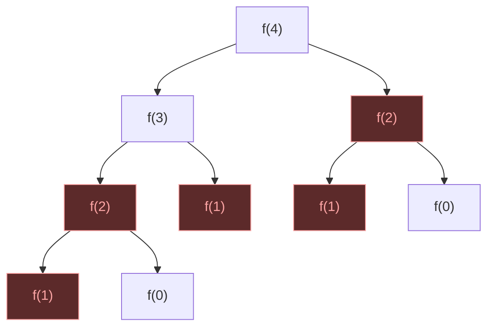
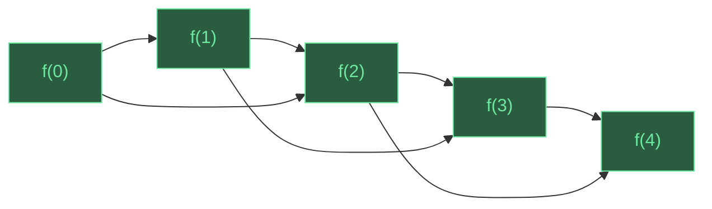

<div class="grid grid-cols-[1fr_1fr] gap-4 items-center w-full">
  <div>
    <div class="uppercase text-base font-bold text-[var(--brand-accent)] text-4xl">LeetCode Problems on Go</div>
    <div class="mt-2 font-bold text-6xl" style="font-family: 'Iowan Old Style', 'Palatino Linotype', Georgia, serif;">Dynamic Programming</div>
    <div class="mt-12 items-center color-[var(--text-secondary)]">Sergei Blinov · AckiNacki</div>
  </div>

  <div class="flex flex-col items-center justify-center">
    <div class="relative w-full overflow-hidden border border-[var(--border-subtle)] rounded-3xl bg-[var(--bg-card)] p-3 shadow-2xl">
      
      <div class="mt-2 rounded-2xl bg-[var(--bg-card)] px-4 py-2 text-lg text-center text-[var(--text-secondary)]">Solving DP problems at a coding interview</div>
    </div>
  </div>
</div>

---
layout: full
---

<div class="w-full h-full relative overflow-hidden">

<!--
  Layout grid (960x540):
  Top row:    [Gopher]  [P≠NP]  [PostgreSQL]  [Euler]  [Ferris]
  Mid row:    [Docker]  [Bayes]            [Basel]  [React]
  Bot row:    [Python]  [Correlation]  [O(n log n)]  [Bun]
-->

<!-- Top row icons -->


<!-- Middle row icons -->


<!-- Bottom row icons -->

<div class="absolute" style="bottom:8px; left:50%; opacity:0.75; transform:translateX(-200px)">
  <div style="font-size:13px; text-align:center; margin-bottom:4px; color:#D97757; font-style:italic; white-space:nowrap; font-weight:bold">You're absolutely right!</div>
  
</div>


<!-- Top row formulas (between icons) -->
<div class="absolute" style="top:50px; left:185px; opacity:0.40">

$P \neq NP$ ???

</div>
<div class="absolute" style="top:40px; right:175px; opacity:0.40">

$e^{i\pi} + 1 = 0$

</div>

<!-- Middle row formulas (between icons and center) -->
<div class="absolute" style="top:50%; left:170px; opacity:0.35; transform:translateY(-40px)">

$\sum \frac{1}{n^2} = \frac{\pi^2}{6}$

</div>
<div class="absolute" style="top:50%; right:160px; opacity:0.35; transform:translateY(-40px); font-size:13px">

$P(A|B) = \frac{P(B|A) \cdot P(A)}{P(B)}$

</div>

<!-- Bottom row formulas (between icons) -->
<div class="absolute" style="bottom:40px; right:160px; opacity:0.35">

$O(n \log n)$

</div>

<!-- Main content centered -->
<div class="absolute inset-0 flex flex-col items-center justify-center z-10">
  <div class="font-bold mb-10" style="font-size:3.5rem; font-family: 'Iowan Old Style', 'Palatino Linotype', Georgia, serif;">Sergei Blinov</div>
  <div class="flex flex-col gap-3 text-lg">
    <div><code>Senior Software Engineer at AckiNacki</code></div>
    <div><code>Math enthusiast</code></div>
    <div><code>Programming language polyglot</code></div>
  </div>
</div>

</div>

---
layout: two-cols
---

# Why companies still ask LeetCode

<div class="lead">
Because obviously the best way to evaluate engineers is a <span class="accent">timed puzzle contest</span>.
</div>

- 10 years of production experience? Sorry, you forgot the two-pointer trick 😂
- It's not a good test — it's a _convenient_ one
- LLM solves LeetCode Hard from a screenshot faster than you can read it 😅
- 40% of hiring managers don't trust it… but use it anyway 🤷

<div class="pt-4 tiny text-[var(--text-muted)]">
And yet… here we all are, grinding LeetCode at midnight 🌙
</div>

::right::

<div class="mt-4 ml-4 rounded-2xl overflow-hidden border border-[var(--border-subtle)] shadow-xl">
  <div style="background:#2a5c3f; padding:12px 16px;">
    <div class="text-xs uppercase tracking-[0.2em] font-bold" style="color:#6ee7a0;">The Interview</div>
    <div class="pt-1 text-sm" style="color:#d1fae5;">
      "Implement a red-black tree with <code>O(1)</code> amortized rotations."
    </div>
    
  </div>
  <div style="background:#5c2a2a; padding:12px 16px;">
    <div class="text-xs uppercase tracking-[0.2em] font-bold" style="color:#fca5a5;">The Job</div>
    <div class="pt-1 text-sm" style="color:#fde8e8;">
      "Move this button 2px to the left."
    </div>
    
  </div>
</div>

---

# Common interview topics

<div class="mt-2">

<div class="text-xs uppercase tracking-[0.2em] font-bold text-[var(--text-muted)] mb-2">Data Structures</div>
<div class="chip-row">
  <div class="chip border-green-400 text-green-400">Arrays & Hashing</div>
  <div class="chip border-green-400 text-green-400">Linked Lists</div>
  <div class="chip border-green-400 text-green-400">Stacks & Queues</div>
  <div class="chip border-amber-400 text-amber-400">Trees & Tries</div>
  <div class="chip border-amber-400 text-amber-400">Heap / Priority Queue</div>
  <div class="chip border-amber-400 text-amber-400">Monotonic Stack</div>
  <div class="chip border-red-400 text-red-400">Segment Tree</div>
  <div class="chip border-red-400 text-red-400">Fenwick Tree</div>
</div>

<div class="text-xs uppercase tracking-[0.2em] font-bold text-[var(--text-muted)] mt-4 mb-2">Techniques & Patterns</div>
<div class="chip-row">
  <div class="chip border-green-400 text-green-400">Two Pointers</div>
  <div class="chip border-green-400 text-green-400">Prefix Sum</div>
  <div class="chip border-green-400 text-green-400">Binary Search</div>
  <div class="chip border-amber-400 text-amber-400">Sliding Window</div>
  <div class="chip border-amber-400 text-amber-400">Bit Manipulation</div>
  <div class="chip border-amber-400 text-amber-400">Union-Find</div>
  <div class="chip border-amber-400 text-amber-400">String Matching (KMP)</div>
  <div class="chip border-red-400 text-red-400">Coordinate Compression</div>
</div>

<div class="text-xs uppercase tracking-[0.2em] font-bold text-[var(--text-muted)] mt-4 mb-2">Algorithms</div>
<div class="chip-row">
  <div class="chip border-green-400 text-green-400">Sorting</div>
  <div class="chip border-amber-400 text-amber-400">BFS / DFS</div>
  <div class="chip border-amber-400 text-amber-400">Backtracking</div>
  <div class="chip border-amber-400 text-amber-400">Greedy</div>
  <div class="chip border-amber-400 text-amber-400">Topological Sort</div>
  <div class="chip border-amber-400 text-amber-400">Shortest Path</div>
  <div class="chip border-red-400 text-red-400">Divide & Conquer</div>
  <div class="chip border-red-400 text-red-400">Game Theory</div>
  <div class="chip font-bold border-[var(--go-blue)] text-[var(--brand-accent)]">Dynamic Programming</div>
</div>

</div>

<div class="mt-4 flex gap-6 text-xs text-[var(--text-muted)]">
  <span class="text-green-400">●</span> <span>Easy</span>
  <span class="text-amber-400">●</span> <span>Medium</span>
  <span class="text-red-400">●</span> <span>Hard</span>
</div>

---
layout: two-cols
---

# Why is it called dynamic programming?

- The name is historical, not descriptive
- It does <span class="accent">not</span> mean "programming" as in writing code
- It does <span class="accent">not</span> mean "dynamic" as in changing over time.

<span class="accent">Richard Bellman</span> coined the term in the 1950s while working at RAND Corporation

- "Programming" here means <span class="accent">planning</span> (as in "linear programming")
- He deliberately chose a vague, impressive name to shield his research from politicians who were hostile to mathematics 🤷

::right::

<div class="flex flex-col items-center mt-4 ml-8">
  
  <div class="mt-3 text-sm text-[var(--text-muted)]">Richard Bellman (1920–1984)</div>
</div>

---
layout: two-cols
---

<div class="mt-2">

<div class="text-xs uppercase tracking-[0.2em] font-bold text-red-400 mb-4">Pure recursion — recomputes everything</div>



<div class="text-xs uppercase tracking-[0.2em] font-bold text-green-400 mb-4 mt-8">DP — each subproblem solved once</div>



</div>

::right::

# DP ≠ Recursion

<div class="lead">
Recursion is a <span class="accent">form</span>, DP is an <span class="accent">idea</span>.
</div>

- Recursion — just a function calling itself
- It does not imply reusing results
- DP can be top-down (recursive) or bottom-up (iterative)
- Not all recursive solutions are DP, and not all DP needs recursion

---
layout: two-cols
---

<div class="rounded-2xl overflow-hidden border border-[var(--border-subtle)] shadow-xl mr-4">
  <div style="background:#2a5c3f; padding:14px 18px;">
    <div class="text-xs uppercase tracking-[0.2em] font-bold" style="color:#6ee7a0;">Memoization</div>
    <div class="pt-2" style="color:#d1fae5;">

```go
var memo = map[int]int{}
func fib(n int) int {
    if v, ok := memo[n]; ok {
        return v
    }
    memo[n] = fib(n-1) + fib(n-2)
    return memo[n]
}
```

  </div>
    <div class="text-xs mt-1" style="color:#6ee7a0;">✓ Also DP — optimal substructure + overlapping subproblems</div>
  </div>
  <div style="background:#5c4a2a; padding:14px 18px;">
    <div class="text-xs uppercase tracking-[0.2em] font-bold" style="color:#fbbf24;">Also "memoization"</div>
    <div class="pt-2" style="color:#fef3c7;">

```go
var cache = map[int]*User{}
func getUser(id int) *User {
    if u, ok := cache[id]; ok {
        return u
    }
    cache[id] = db.Query(id)
    return cache[id]
}
```

  </div>
    <div class="text-xs mt-1" style="color:#fbbf24;">✗ Not DP — just caching, no subproblem structure</div>
  </div>
</div>

::right::

# DP ≠ Memoization

<div class="lead">
Memoization is a <span class="accent">technique</span> that often implements DP, but not every cache is DP.
</div>

- Memoization = caching results of pure functions
- It is the standard way to implement top-down DP
- But caching an HTTP response is memoization too — not DP
- DP requires two properties:
  - <span class="accent">Optimal substructure</span>
  - <span class="accent">Overlapping subproblems</span>

---
layout: two-cols
---

<div class="mr-4">
  <div class="problem-card">
    <div class="text-sm uppercase tracking-[0.2em] text-red-400 font-semibold">When Greedy Breaks</div>

Coins = `{1, 3, 4}`, target = `6`

🟥 Greedy is not optimal: `4 + 1 + 1` = 3 coins

🟩 DP: `3 + 3` = 2 coins

  </div>
  <div class="mt-3 w-4/5 mx-auto h-88 rounded shadow">
    
  </div>
</div>

::right::

# DP ≠ Greedy

- Greedy makes the <span class="accent">locally best</span> and never looks back
- Greedy works when local optimum guarantees global optimum
- Classic example: **Coin Change**
  - <span class="text-green-400">Greedy works</span> for `{1, 5, 10, 25}` — always pick the biggest coin
  - <span class="text-red-400">Greedy fails</span> for `{1, 3, 4}`, target `6`: greedy gives `4+1+1`, DP gives `3+3`

---

# DP ≠ Backtracking

<div class="grid grid-cols-3 gap-6 mt-12 text-center">
  <div>
    <div class="text-5xl mb-4 opacity-40">🌳</div>
    <pre class="text-xs leading-tight inline-block text-left opacity-50">
    *
   / \
  *   *
 /\   /\
*  * *  *
    </pre>
    <div class="mt-4 text-lg font-bold text-gray-400">Brute Force</div>
    <div class="text-sm text-gray-500 mt-1">visit every node</div>
    <div class="mt-2 font-mono text-red-400">O(2ⁿ)</div>

  </div>
  <div>
    <div class="text-5xl mb-4">🌳</div>
    <pre class="text-xs leading-tight inline-block text-left">
    *
   / \
  *   <span class="text-gray-600">✗</span>
 /\
<span class="text-gray-600">✗</span>  *
    </pre>
    <div class="mt-4 text-lg font-bold text-yellow-400">Backtracking</div>
    <div class="text-sm text-gray-500 mt-1">prune bad branches</div>
    <div class="mt-2 font-mono text-red-400">O(2ⁿ)</div>
  </div>
  <div>
    <div class="text-5xl mb-4">🧠</div>
    <pre class="text-xs leading-tight inline-block text-left">
    *
   / \
  *   * ✓ reuse
 /\
*  * ✓ cache 
    </pre>
    <div class="mt-4 text-lg font-bold text-[var(--brand-accent)]">DP</div>
    <div class="text-sm text-gray-500 mt-1">cache &amp; reuse subproblems</div>
    <div class="mt-2 font-mono text-green-400">polynomial</div>
  </div>
</div>

---
layout: two-cols
---

# DP ≠ Combinatorix

<div class="mt-6 text-2xl">

$$C_n = \frac{1}{n+1}\binom{2n}{n}$$

$C_0 = \frac{1}{1}\binom{0}{0} = 1$

$C_1 = \frac{1}{2}\binom{2}{1} = 1$

$C_2 = \frac{1}{3}\binom{4}{2} = 2$

$C_3 = \frac{1}{4}\binom{6}{3} = 5$

$C_4 = \frac{1}{5}\binom{8}{4} = 14$

$C_5 = \frac{1}{6}\binom{10}{5} = 42$

</div>

::right::

<svg viewBox="0 0 320 320" class="mt-10 w-full mx-auto" xmlns="http://www.w3.org/2000/svg">
  <style>
    .cell { fill: #1e293b; stroke: #334155; stroke-width: 1; }
    .cell-diag { fill: #0d9488; fill-opacity: 0.25; stroke: #2dd4bf; stroke-width: 1.5; }
    .num { fill: #e2e8f0; font-family: monospace; font-size: 14px; text-anchor: middle; dominant-baseline: central; }
    .num-diag { fill: #2dd4bf; font-family: monospace; font-size: 14px; font-weight: bold; text-anchor: middle; dominant-baseline: central; }
    .cell-hl { fill: #f59e0b; fill-opacity: 0.2; stroke: #fbbf24; stroke-width: 1.5; }
    .num-hl { fill: #fbbf24; font-family: monospace; font-size: 14px; font-weight: bold; text-anchor: middle; dominant-baseline: central; }
    .arrow { stroke: #fbbf24; stroke-width: 1.5; fill: none; marker-end: url(#arr); }
  </style>
  <defs>
    <marker id="arr" markerWidth="6" markerHeight="4" refX="5" refY="2" orient="auto">
      <path d="M0,0 L6,2 L0,4" fill="#fbbf24"/>
    </marker>
  </defs>
  <!-- row 0 -->
  <rect x="10" y="10" width="38" height="38" rx="4" class="cell-diag"/>
  <text x="29" y="29" class="num-diag">1</text>
  <!-- row 1 -->
  <rect x="10" y="62" width="38" height="38" rx="4" class="cell"/>
  <text x="29" y="81" class="num">1</text>
  <rect x="62" y="62" width="38" height="38" rx="4" class="cell-diag"/>
  <text x="81" y="81" class="num-diag">1</text>
  <!-- row 2 -->
  <rect x="10" y="114" width="38" height="38" rx="4" class="cell"/>
  <text x="29" y="133" class="num">1</text>
  <rect x="62" y="114" width="38" height="38" rx="4" class="cell"/>
  <text x="81" y="133" class="num">2</text>
  <rect x="114" y="114" width="38" height="38" rx="4" class="cell-diag"/>
  <text x="133" y="133" class="num-diag">2</text>
  <!-- row 3 -->
  <rect x="10" y="166" width="38" height="38" rx="4" class="cell"/>
  <text x="29" y="185" class="num">1</text>
  <rect x="62" y="166" width="38" height="38" rx="4" class="cell"/>
  <text x="81" y="185" class="num">3</text>
  <rect x="114" y="166" width="38" height="38" rx="4" class="cell"/>
  <text x="133" y="185" class="num">5</text>
  <rect x="166" y="166" width="38" height="38" rx="4" class="cell-diag"/>
  <text x="185" y="185" class="num-diag">5</text>
  <!-- row 4 -->
  <rect x="10" y="218" width="38" height="38" rx="4" class="cell"/>
  <text x="29" y="237" class="num">1</text>
  <rect x="62" y="218" width="38" height="38" rx="4" class="cell"/>
  <text x="81" y="237" class="num">4</text>
  <rect x="114" y="218" width="38" height="38" rx="4" class="cell-hl"/>
  <text x="133" y="237" class="num-hl">9</text>
  <!-- arrows: 4 (left) + 5 (above) = 9 -->
  <path d="M101,237 L112,237" class="arrow"/>
  <path d="M133,205 L133,216" class="arrow"/>
  <rect x="166" y="218" width="38" height="38" rx="4" class="cell"/>
  <text x="185" y="237" class="num">14</text>
  <rect x="218" y="218" width="38" height="38" rx="4" class="cell-diag"/>
  <text x="237" y="237" class="num-diag">14</text>
  <!-- row 5 -->
  <rect x="10" y="270" width="38" height="38" rx="4" class="cell"/>
  <text x="29" y="289" class="num">1</text>
  <rect x="62" y="270" width="38" height="38" rx="4" class="cell"/>
  <text x="81" y="289" class="num">5</text>
  <rect x="114" y="270" width="38" height="38" rx="4" class="cell"/>
  <text x="133" y="289" class="num">14</text>
  <rect x="166" y="270" width="38" height="38" rx="4" class="cell"/>
  <text x="185" y="289" class="num">28</text>
  <rect x="218" y="270" width="38" height="38" rx="4" class="cell"/>
  <text x="237" y="289" class="num">42</text>
  <rect x="270" y="270" width="38" height="38" rx="4" class="cell-diag"/>
  <text x="289" y="289" class="num-diag">42</text>
</svg>

---

# Problem 1: House Robber

<div class="lead">
Easy to explain, easy to brute force, but already useful for introducing the core DP habit:
<span class="accent">at index i, what is the best answer so far?</span>
</div>

<div class="problem-card mt-6">
Given an integer array `nums`, return the maximum amount of money you can rob tonight without robbing two adjacent houses.
</div>

- Brute force asks: rob this house or skip it?
- DP asks: what is the best total ending at position `i`?
- This is a classic 1D recurrence

---

# House Robber: state and transition

`dp[i]` = best answer considering houses `0..i`

Recurrence:

```text
dp[i] = max(
  dp[i - 1],           // skip house i
  dp[i - 2] + nums[i]  // rob house i
)
```

Base cases:

- `dp[0] = nums[0]`
- `dp[1] = max(nums[0], nums[1])`

Optimization:

- We only need the previous two states
- Space goes from `O(n)` to `O(1)`

---

# House Robber in Go

```go
func rob(nums []int) int {
	if len(nums) == 1 {
		return nums[0]
	}

	prev := nums[0]
	cur := max(nums[0], nums[1])

	for i := 2; i < len(nums); i++ {
		prev, cur = cur, max(cur, prev+nums[i])
	}

	return cur
}
```

---

# Problem 2: Longest Increasing Subsequence

<div class="lead">
Now the state is still 1D, but the transition is no longer local.
Each position may depend on <span class="accent">many previous positions</span>.
</div>

<div class="problem-card mt-6">
Given an integer array `nums`, return the length of the longest strictly increasing subsequence.
</div>

- This is a good "medium" DP problem
- It teaches how to define "best answer ending at index i"
- It also opens the door to discussing better-than-DP solutions later

---

# LIS: state and transition

`dp[i]` = length of the longest increasing subsequence that ends at `i`

Transition:

```text
dp[i] = 1 + max(dp[j]) for all j < i where nums[j] < nums[i]
```

If there is no such `j`, then:

```text
dp[i] = 1
```

Key idea:

- We are not asking for the best subsequence anywhere
- We are asking for the best subsequence that must end at a specific position

Final answer:

```text
max(dp[i]) for all i
```

---

# Longest Increasing Subsequence in Go

```go
func lengthOfLIS(nums []int) int {
	n := len(nums)
	dp := make([]int, n)
	best := 1

	for i := 0; i < n; i++ {
		dp[i] = 1
		for j := 0; j < i; j++ {
			if nums[j] < nums[i] {
				dp[i] = max(dp[i], dp[j]+1)
			}
		}
		best = max(best, dp[i])
	}

	return best
}
```

---

# Problem 3: Cherry Pickup II

<div class="lead">
This is where DP starts to feel genuinely hard: the state must represent
<span class="accent">two agents moving at the same time</span>.
</div>

<div class="problem-card mt-6">
Two robots start at the top row of a grid, one on the left and one on the right. On each step, both move to the next row and may shift by `-1`, `0`, or `+1` columns. Maximize the total cherries collected.
</div>

- A greedy approach fails quickly
- A naive DFS explodes because the branching factor is large
- The key is to encode both robot positions in the state

---

# Cherry Pickup II: state design

State:

```text
dp[row][col1][col2]
```

Meaning:

- we are on `row`
- robot A is at `col1`
- robot B is at `col2`
- value = maximum cherries collectable from this state to the bottom

Transition:

- each robot has 3 moves
- total next states per step = `3 x 3 = 9`

Reward on the current row:

```text
grid[row][col1] + grid[row][col2]
```

If `col1 == col2`, count that cell only once.

---

# Cherry Pickup II: recurrence

```text
dp[row][c1][c2] =
  cherries(row, c1, c2) +
  max(
    dp[row + 1][nc1][nc2]
    for nc1 in {c1 - 1, c1, c1 + 1}
    for nc2 in {c2 - 1, c2, c2 + 1}
  )
```

Important details:

- invalid columns must be skipped
- the last row is the base case
- top-down memoization and bottom-up DP both work

Complexity:

- States: `O(rows * cols * cols)`
- Transitions per state: constant (`9`)
- Total: `O(rows * cols²)`

---

# Cherry Pickup II in Go

```go
func cherryPickup(grid [][]int) int {
	rows, cols := len(grid), len(grid[0])
	dp := make([][][]int, rows)
	for r := 0; r < rows; r++ {
		dp[r] = make([][]int, cols)
		for c1 := 0; c1 < cols; c1++ {
			dp[r][c1] = make([]int, cols)
		}
	}

	for c1 := 0; c1 < cols; c1++ {
		for c2 := 0; c2 < cols; c2++ {
			dp[rows-1][c1][c2] = grid[rows-1][c1]
			if c1 != c2 {
				dp[rows-1][c1][c2] += grid[rows-1][c2]
			}
		}
	}

	for r := rows - 2; r >= 0; r-- {
		for c1 := 0; c1 < cols; c1++ {
			for c2 := 0; c2 < cols; c2++ {
				best := 0
				for d1 := -1; d1 <= 1; d1++ {
					for d2 := -1; d2 <= 1; d2++ {
						nc1, nc2 := c1+d1, c2+d2
						if nc1 >= 0 && nc1 < cols && nc2 >= 0 && nc2 < cols {
							best = max(best, dp[r+1][nc1][nc2])
						}
					}
				}
				dp[r][c1][c2] = grid[r][c1]
				if c1 != c2 {
					dp[r][c1][c2] += grid[r][c2]
				}
				dp[r][c1][c2] += best
			}
		}
	}

	return dp[0][0][cols-1]
}
```

---

# What these three problems teach

1. `House Robber`: a DP state can be tiny and still powerful
2. `LIS`: the hard part is often defining the right subproblem
3. `Cherry Pickup II`: complexity jumps when the state tracks multiple moving pieces

<div class="pt-8 lead">
The recurring checklist is always the same:
</div>

- What does my state mean?
- What choices move me to the next state?
- What is the base case?
- Can I reduce memory without losing information?

---

# References

- [House Robber](https://leetcode.com/problems/house-robber/)
- [Longest Increasing Subsequence](https://leetcode.com/problems/longest-increasing-subsequence/)
- [Cherry Pickup II](https://leetcode.com/problems/cherry-pickup-ii/)
- [Slidev Documentation](https://sli.dev/)

<div class="pt-8 text-[var(--text-muted)]">
Optional ending ideas:
</div>

- "If you panic in DP, start by naming the state."
- "Interview DP is usually less about magic and more about bookkeeping."
- Add your GitHub / LinkedIn / QR code here.

---
layout: center
class: text-center
---

# Thank You

Questions?

<div class="pt-6 text-[var(--text-muted)]">
`your.name@example.com` • `github.com/your-handle`
</div>
